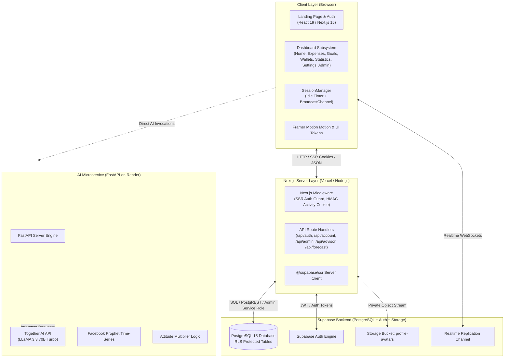
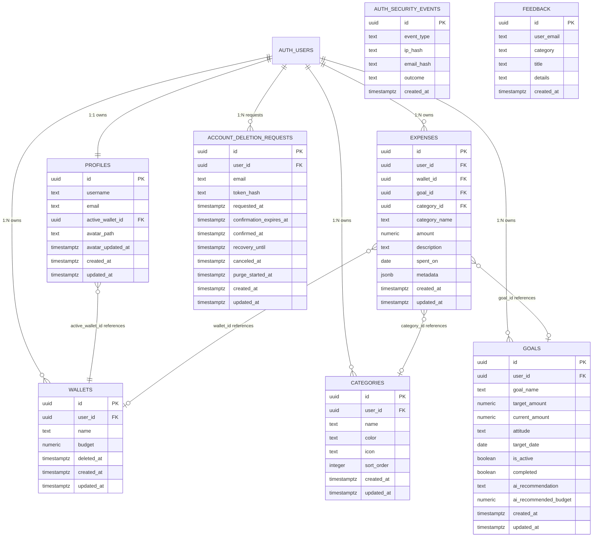
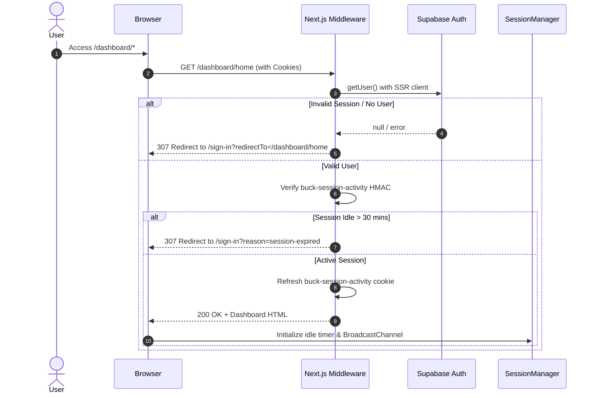
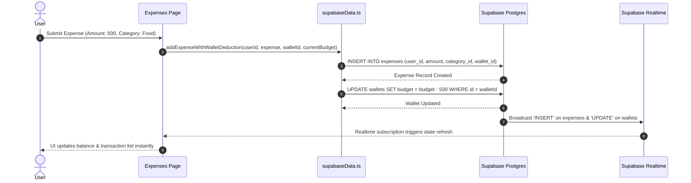

# Design.md: System Architecture, Data Models & ADRs

This document defines the high-level architecture, database schemas, interaction workflows, directory structure, and Architectural Decision Records (ADRs) for the **Buck Budget Tracker Web Application**.

---

## 1. High-Level System Architecture



---

## 2. Database Schemas & Entity Relationships



### Table Definitions & Constraints

1. **`public.profiles`**:
   - `id`: Primary key referencing `auth.users(id)` `ON DELETE CASCADE`.
   - `active_wallet_id`: Foreign key to `public.wallets(id)` `ON DELETE SET NULL`.
   - Trigger `ensure_profile_active_wallet_owner`: Verifies assigned wallet belongs to profile owner.
2. **`public.wallets`**:
   - `budget`: `numeric(14, 2) check (budget >= 0)`.
   - `deleted_at`: Supports soft deletion without violating historical expense foreign keys.
3. **`public.categories`**:
   - Unique index `categories_user_id_lower_name_key` prevents duplicate category names per user.
4. **`public.goals`**:
   - Partial unique index `goals_one_active_goal_per_user_idx` ensures only one goal per user has `is_active = true`.
5. **`public.expenses`**:
   - Trigger `ensure_expense_relations_owner`: Enforces that `wallet_id`, `goal_id`, and `category_id` belong to the same `user_id`.
6. **`public.account_deletion_requests`**:
   - Enforces 10-day recovery window with email confirmation token. Partial index `account_deletion_one_open_request_per_user_idx`.
7. **`public.auth_security_events`**:
   - Private logging table with zero raw IP or email storage. Access revoked from `anon` and `authenticated`.

---

## 3. Core System Data Flows

### 3.1 Authentication & Session Security Flow



### 3.2 Expense Logging & Wallet Deduction Flow



---

## 4. Directory Structure

```
Buck-Web-Application/
├── Agents.md                   # AI agent roles and collaboration boundaries
├── Skills.md                   # Machine-readable function and API catalog
├── Design.md                   # Architecture, schemas, flows, and ADRs
├── Implementation.md           # Setup, runtime configs, and execution logic
├── QA_Report.md                # Quality audit, defects, and security tracking
├── README.md                   # Repository overview and entry guide
├── buck/                       # Next.js 15 Web Application
│   ├── BuckAI_Backend/         # Python FastAPI AI microservice
│   │   ├── ai_models.py        # Together AI, Prophet, XGBoost models
│   │   ├── main.py             # FastAPI routing and endpoints
│   │   └── requirements.txt    # Python dependencies
│   ├── docs/                   # Domain-specific UI/Auth documentation
│   ├── public/                 # Static assets (images, SVGs, audio)
│   ├── supabase/
│   │   └── migrations/         # PostgreSQL schema migrations
│   ├── src/
│   │   ├── app/                # Next.js App Router (pages & API routes)
│   │   │   ├── api/            # Server Route Handlers
│   │   │   ├── dashboard/      # Authenticated views (home, expenses, goals, etc.)
│   │   │   ├── globals.css     # Global CSS design tokens
│   │   │   ├── layout.tsx      # Root layout
│   │   │   └── page.tsx        # Public landing page
│   │   ├── component/          # Shared components (AuthGuard, SessionManager, Header)
│   │   ├── constants/          # Static copy and legal text
│   │   ├── context/            # Global React state (FinancialContext, UserContext)
│   │   ├── hooks/              # Reusable React hooks
│   │   ├── middleware.ts       # SSR authentication and session HMAC gatekeeper
│   │   └── utils/              # Data services, Supabase clients, formatters
│   └── package.json            # Node.js dependencies and scripts
```

---

## 5. Architectural Decision Records (ADRs)

### ADR-001: Supabase SSR Authentication with HMAC-Signed Activity Cookies
- **Context**: The app requires robust authentication across server components, route handlers, and client pages while enforcing strict idle timeouts.
- **Decision**: Implemented `@supabase/ssr` with Next.js `middleware.ts`. Session freshness is validated via an HMAC-SHA256 signed `buck-session-activity` cookie.
- **Consequences**: Provides seamless server-side route protection without relying on client hydration, preventing unauthorized content flashing.

### ADR-002: In-Memory Client State Caching via `FinancialContext`
- **Context**: Switching between dashboard tabs previously triggered repeated full-table queries, causing skeleton flashes and latency.
- **Decision**: Implemented `DashboardDataCache` in `FinancialContext.tsx` with timestamps. Data is held in memory during the session and updated in background via Supabase Realtime subscriptions.
- **Consequences**: Instantaneous navigation between tabs. Memory is securely cleared upon browser reload or logout.

### ADR-003: Soft-Deletion for Multi-Wallet Management
- **Context**: Hard deleting a wallet deletes or nullifies associated historical expense records, corrupting financial reporting.
- **Decision**: Added `deleted_at timestamptz` to `public.wallets`. The UI hides soft-deleted wallets from active selectors while preserving them in history.
- **Consequences**: Maintains full referential integrity and historical reporting accuracy across all expense records.

### ADR-004: Decoupled FastAPI Microservice for AI & ML Inference
- **Context**: Running complex Python time-series models (Prophet) and LLM prompt orchestrations directly in Node.js serverless functions is computationally heavy.
- **Decision**: Decoupled AI inference into a dedicated Python FastAPI service running on Render.
- **Consequences**: Enables Python ML library execution; however, requires rigorous cross-service contract synchronization (see [`QA_Report.md`](file:///d:/VS%20Code/Buck-Budget-Tracker/Buck-Web-Application/QA_Report.md)).

### ADR-005: Zero-Knowledge Password Reset Rate Limiting
- **Context**: Reset endpoints must prevent brute-force attacks without storing plaintext user emails or IP addresses.
- **Decision**: Implemented `auth_security_events` table storing SHA-256 HMAC hashes derived from server-side secrets.
- **Consequences**: Complies with privacy standards while effectively enforcing sliding-window rate limits.
