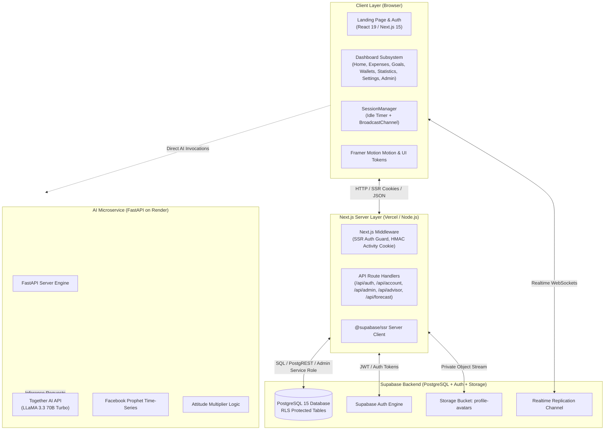
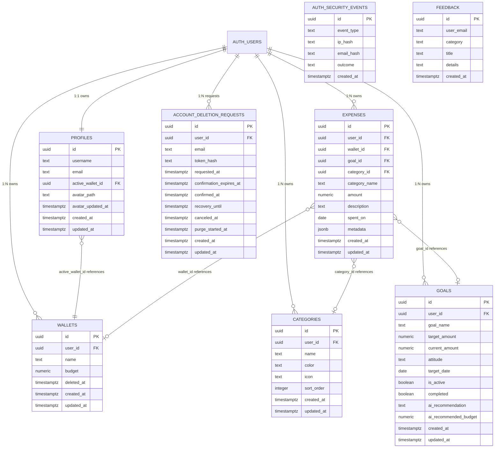
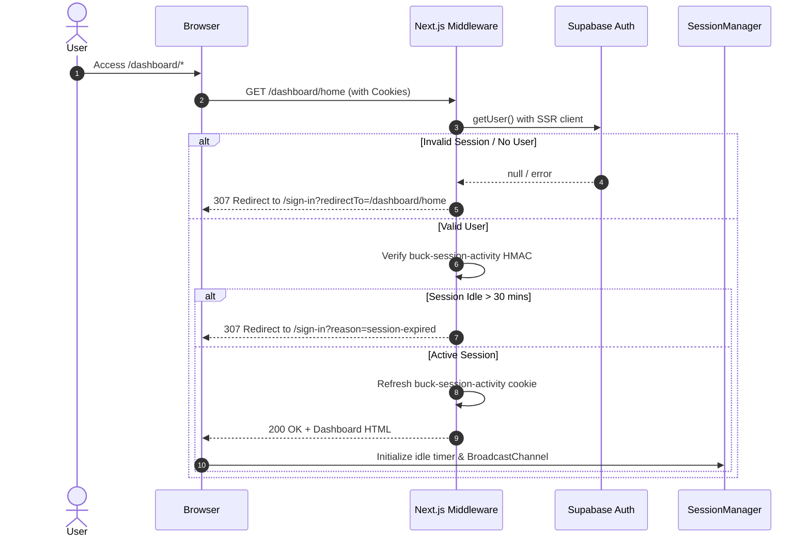
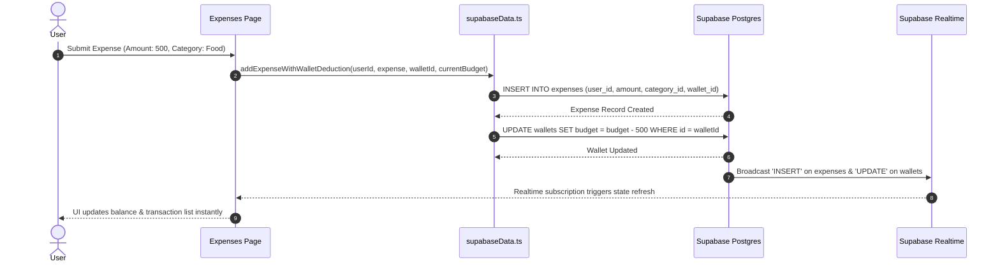

# Design.md: System Architecture, Data Models & ADRs

This document defines the high-level architecture, database schemas, interaction workflows, directory structure, and Architectural Decision Records (ADRs) for the **Buck Budget Tracker Web Application**.

---

## 1. High-Level System Architecture


```mermaid
flowchart TB
    subgraph ClientLayer ["Client Layer (Browser)"]
        LandingPage["Landing Page & Auth\n(React 19 / Next.js 15)"]
        Dashboard["Dashboard Subsystem\n(Home, Expenses, Goals, Wallets, Statistics, Settings, Admin)"]
        SessionMgr["SessionManager\n(Idle Timer + BroadcastChannel)"]
        FramerMotion["Framer Motion Motion & UI Tokens"]
    end

    subgraph AppServer ["Next.js Server Layer (Vercel / Node.js)"]
        Middleware["Next.js Middleware\n(SSR Auth Guard, HMAC Activity Cookie)"]
        RouteHandlers["API Route Handlers\n(/api/auth, /api/account, /api/admin, /api/advisor, /api/forecast)"]
        SSRClient["@supabase/ssr Server Client"]
    end

    subgraph DataLayer ["Supabase Backend (PostgreSQL + Auth + Storage)"]
        PgDB[(PostgreSQL 15 Database\nRLS Protected Tables)]
        SupaAuth[Supabase Auth Engine]
        SupaStorage[Storage Bucket: profile-avatars]
        SupaRealtime[Realtime Replication Channel]
    end

    subgraph AIMicroservice ["AI Microservice (FastAPI on Render)"]
        FastAPIServer[FastAPI Server Engine]
        TogetherAI["Together AI API\n(LLaMA 3.3 70B Turbo)"]
        ProphetModel[Facebook Prophet Time-Series]
        XGBoostMap[Attitude Multiplier Logic]
    end

    ClientLayer <-->|HTTP / SSR Cookies / JSON| AppServer
    ClientLayer <-->|Realtime WebSockets| SupaRealtime
    AppServer <-->|SQL / PostgREST / Admin Service Role| PgDB
    AppServer <-->|JWT / Auth Tokens| SupaAuth
    AppServer <-->|Private Object Stream| SupaStorage
    ClientLayer -.->|Direct AI Invocations| AIMicroservice
    AIMicroservice <-->|Inference Requests| TogetherAI
```

---

## 2. Database Schemas & Entity Relationships


```mermaid
erDiagram
    AUTH_USERS ||--|| PROFILES : "1:1 owns"
    AUTH_USERS ||--o{ WALLETS : "1:N owns"
    AUTH_USERS ||--o{ CATEGORIES : "1:N owns"
    AUTH_USERS ||--o{ GOALS : "1:N owns"
    AUTH_USERS ||--o{ EXPENSES : "1:N owns"
    AUTH_USERS ||--o{ ACCOUNT_DELETION_REQUESTS : "1:N requests"
    
    PROFILES }o--|| WALLETS : "active_wallet_id references"
    EXPENSES }o--o| WALLETS : "wallet_id references"
    EXPENSES }o--o| GOALS : "goal_id references"
    EXPENSES }o--o| CATEGORIES : "category_id references"

    PROFILES {
        uuid id PK
        text username
        text email
        uuid active_wallet_id FK
        text avatar_path
        timestamptz avatar_updated_at
        timestamptz created_at
        timestamptz updated_at
    }

    WALLETS {
        uuid id PK
        uuid user_id FK
        text name
        numeric budget
        timestamptz deleted_at
        timestamptz created_at
        timestamptz updated_at
    }

    CATEGORIES {
        uuid id PK
        uuid user_id FK
        text name
        text color
        text icon
        integer sort_order
        timestamptz created_at
        timestamptz updated_at
    }

    GOALS {
        uuid id PK
        uuid user_id FK
        text goal_name
        numeric target_amount
        numeric current_amount
        text attitude
        date target_date
        boolean is_active
        boolean completed
        text ai_recommendation
        numeric ai_recommended_budget
        timestamptz created_at
        timestamptz updated_at
    }

    EXPENSES {
        uuid id PK
        uuid user_id FK
        uuid wallet_id FK
        uuid goal_id FK
        uuid category_id FK
        text category_name
        numeric amount
        text description
        date spent_on
        jsonb metadata
        timestamptz created_at
        timestamptz updated_at
    }

    ACCOUNT_DELETION_REQUESTS {
        uuid id PK
        uuid user_id FK
        text email
        text token_hash
        timestamptz requested_at
        timestamptz confirmation_expires_at
        timestamptz confirmed_at
        timestamptz recovery_until
        timestamptz canceled_at
        timestamptz purge_started_at
        timestamptz created_at
        timestamptz updated_at
    }

    AUTH_SECURITY_EVENTS {
        uuid id PK
        text event_type
        text ip_hash
        text email_hash
        text outcome
        timestamptz created_at
    }

    FEEDBACK {
        uuid id PK
        text user_email
        text category
        text title
        text details
        timestamptz created_at
    }
```

### Table Definitions & Constraints

1. **`public.profiles`**:
   - `id`: Primary key referencing `auth.users(id)` `ON DELETE CASCADE`.
   - `active_wallet_id`: Foreign key to `public.wallets(id)` `ON DELETE SET NULL`.
   - Trigger `ensure_profile_active_wallet_owner`: Verifies assigned wallet belongs to profile owner.
2. **`public.wallets`**:
   - `budget`: `numeric(14, 2) check (budget >= 0)`.
   - `deleted_at`: Supports soft deletion without violating historical expense foreign keys.
3. **`public.categories`**:
   - Unique index `categories_user_id_lower_name_key` prevents duplicate category names per user.
4. **`public.goals`**:
   - Partial unique index `goals_one_active_goal_per_user_idx` ensures only one goal per user has `is_active = true`.
5. **`public.expenses`**:
   - Trigger `ensure_expense_relations_owner`: Enforces that `wallet_id`, `goal_id`, and `category_id` belong to the same `user_id`.
6. **`public.account_deletion_requests`**:
   - Enforces 10-day recovery window with email confirmation token. Partial index `account_deletion_one_open_request_per_user_idx`.
7. **`public.auth_security_events`**:
   - Private logging table with zero raw IP or email storage. Access revoked from `anon` and `authenticated`.

---

## 3. Core System Data Flows

### 3.1 Authentication & Session Security Flow


```mermaid
sequenceDiagram
    autonumber
    actor User
    participant Browser
    participant Middleware as Next.js Middleware
    participant SupaAuth as Supabase Auth
    participant SM as SessionManager

    User->>Browser: Access /dashboard/*
    Browser->>Middleware: GET /dashboard/home (with Cookies)
    Middleware->>SupaAuth: getUser() with SSR client
    alt Invalid Session / No User
        SupaAuth-->>Middleware: null / error
        Middleware-->>Browser: 307 Redirect to /sign-in?redirectTo=/dashboard/home
    else Valid User
        Middleware->>Middleware: Verify buck-session-activity HMAC
        alt Session Idle > 30 mins
            Middleware-->>Browser: 307 Redirect to /sign-in?reason=session-expired
        else Active Session
            Middleware->>Middleware: Refresh buck-session-activity cookie
            Middleware-->>Browser: 200 OK + Dashboard HTML
            Browser->>SM: Initialize idle timer & BroadcastChannel
        end
    end
```

### 3.2 Expense Logging & Wallet Deduction Flow


```mermaid
sequenceDiagram
    autonumber
    actor User
    participant ExpensesPage as Expenses Page
    participant SupaData as supabaseData.ts
    participant Postgres as Supabase Postgres
    participant Realtime as Supabase Realtime

    User->>ExpensesPage: Submit Expense (Amount: 500, Category: Food)
    ExpensesPage->>SupaData: addExpenseWithWalletDeduction(userId, expense, walletId, currentBudget)
    SupaData->>Postgres: INSERT INTO expenses (user_id, amount, category_id, wallet_id)
    Postgres-->>SupaData: Expense Record Created
    SupaData->>Postgres: UPDATE wallets SET budget = budget - 500 WHERE id = walletId
    Postgres-->>SupaData: Wallet Updated
    Postgres->>Realtime: Broadcast 'INSERT' on expenses & 'UPDATE' on wallets
    Realtime-->>ExpensesPage: Realtime subscription triggers state refresh
    ExpensesPage-->>User: UI updates balance & transaction list instantly
```

---

## 4. Directory Structure

```
Buck-Web-Application/
├── Agents.md                   # AI agent roles and collaboration boundaries
├── Skills.md                   # Machine-readable function and API catalog
├── Design.md                   # Architecture, schemas, flows, and ADRs
├── Implementation.md           # Setup, runtime configs, and execution logic
├── QA_Report.md                # Quality audit, defects, and security tracking
├── README.md                   # Repository overview and entry guide
├── buck/                       # Next.js 15 Web Application
│   ├── BuckAI_Backend/         # Python FastAPI AI microservice
│   │   ├── ai_models.py        # Together AI, Prophet, XGBoost models
│   │   ├── main.py             # FastAPI routing and endpoints
│   │   └── requirements.txt    # Python dependencies
│   ├── docs/                   # Domain-specific UI/Auth documentation
│   ├── public/                 # Static assets (images, SVGs, audio)
│   ├── supabase/
│   │   └── migrations/         # PostgreSQL schema migrations
│   ├── src/
│   │   ├── app/                # Next.js App Router (pages & API routes)
│   │   │   ├── api/            # Server Route Handlers
│   │   │   ├── dashboard/      # Authenticated views (home, expenses, goals, etc.)
│   │   │   ├── globals.css     # Global CSS design tokens
│   │   │   ├── layout.tsx      # Root layout
│   │   │   └── page.tsx        # Public landing page
│   │   ├── component/          # Shared components (AuthGuard, SessionManager, Header)
│   │   ├── constants/          # Static copy and legal text
│   │   ├── context/            # Global React state (FinancialContext, UserContext)
│   │   ├── hooks/              # Reusable React hooks
│   │   ├── middleware.ts       # SSR authentication and session HMAC gatekeeper
│   │   └── utils/              # Data services, Supabase clients, formatters
│   └── package.json            # Node.js dependencies and scripts
```

---

## 5. Architectural Decision Records (ADRs)

### ADR-001: Supabase SSR Authentication with HMAC-Signed Activity Cookies
- **Context**: The app requires robust authentication across server components, route handlers, and client pages while enforcing strict idle timeouts.
- **Decision**: Implemented `@supabase/ssr` with Next.js `middleware.ts`. Session freshness is validated via an HMAC-SHA256 signed `buck-session-activity` cookie.
- **Consequences**: Provides seamless server-side route protection without relying on client hydration, preventing unauthorized content flashing.

### ADR-002: In-Memory Client State Caching via `FinancialContext`
- **Context**: Switching between dashboard tabs previously triggered repeated full-table queries, causing skeleton flashes and latency.
- **Decision**: Implemented `DashboardDataCache` in `FinancialContext.tsx` with timestamps. Data is held in memory during the session and updated in background via Supabase Realtime subscriptions.
- **Consequences**: Instantaneous navigation between tabs. Memory is securely cleared upon browser reload or logout.

### ADR-003: Soft-Deletion for Multi-Wallet Management
- **Context**: Hard deleting a wallet deletes or nullifies associated historical expense records, corrupting financial reporting.
- **Decision**: Added `deleted_at timestamptz` to `public.wallets`. The UI hides soft-deleted wallets from active selectors while preserving them in history.
- **Consequences**: Maintains full referential integrity and historical reporting accuracy across all expense records.

### ADR-004: Decoupled FastAPI Microservice for AI & ML Inference
- **Context**: Running complex Python time-series models (Prophet) and LLM prompt orchestrations directly in Node.js serverless functions is computationally heavy.
- **Decision**: Decoupled AI inference into a dedicated Python FastAPI service running on Render.
- **Consequences**: Enables Python ML library execution; however, requires rigorous cross-service contract synchronization (see [`QA_Report.md`](file:///d:/VS%20Code/Buck-Budget-Tracker/Buck-Web-Application/QA_Report.md)).

### ADR-005: Zero-Knowledge Password Reset Rate Limiting
- **Context**: Reset endpoints must prevent brute-force attacks without storing plaintext user emails or IP addresses.
- **Decision**: Implemented `auth_security_events` table storing SHA-256 HMAC hashes derived from server-side secrets.
- **Consequences**: Complies with privacy standards while effectively enforcing sliding-window rate limits.

### ADR-006: Database Policy Consolidation & Function Security Hardening
- **Context**: Multiple legacy RLS policies led to duplicate evaluations, sub-optimal auth function queries per row, and trigger functions were exposed to unauthenticated public RPC calls.
- **Decision**: Applied migration `202606140001_security_and_policy_hardening.sql`: revoked direct execute on trigger/definer functions from `PUBLIC, anon, authenticated`, fixed function `search_path = public`, consolidated duplicate RLS policies with `(select auth.uid())` initplan caching, and added covering indexes on foreign keys.
- **Consequences**: Eliminates database linter security advisories, prevents unauthorized RPC trigger execution, and enhances query throughput at scale.

### ADR-007: Home Dashboard Weekly Spending Pie Graph with Top-4 + Others Cap & Interpretation Card
- **Context**: The previous Weekly Spending widget only presented an aggregate total in an orange ring, providing no categorical breakdown of where weekly funds were deployed.
- **Decision**: Replaced the static ring with `WeeklyPieChart.tsx` displaying category shares capped at a maximum of 5 elements (Top 4 categories + an aggregated 5th "Others" slice). Introduced a dedicated `WeeklyInterpretationCard.tsx` directly beneath the weekly overview that algorithmically analyzes category concentration, daily pacing, and wallet utilization in Philippine Peso (PHP).
- **Consequences**: Delivers instant categorical visibility, limits chart clutter to exactly 5 slices per UI/UX principles, and provides contextual, actionable financial interpretation for the user.

### ADR-008: Expenses Tab KPI Data Visualization & Category Allocation UX Overhaul
- **Context**: The Expenses page previously rendered static typography for top KPI metrics (Wallet left, Total tracked, Average expense) without graphical progress indicators, spending velocity metrics, or category filtering controls.
- **Decision**: Overhauled the Expenses dashboard (`app/dashboard/expenses/page.tsx`):
  1. Replaced static stats with `ExpenseKPICards.tsx` featuring:
     - **Wallet Balance**: Dynamic multi-stage capacity progress bar (`percentRemaining`), health badges (Healthy, Caution, Critical, Depleted), and available vs. spent breakdown.
     - **Total Tracked**: 7-day micro-bar sparkline histogram displaying daily spend distribution alongside monthly velocity.
     - **Average Expense**: Range benchmark track locating the average pin between minimum and maximum transaction extremes with top single expense highlights.
  2. Implemented `ExpenseCategoryVisualizer.tsx`: A proportional multi-segmented category allocation bar and interactive category filter chips.
  3. Upgraded the transaction workflow: Quick amount preset chips (+50, +100, +200, +500, +1000), overbudget warning indicators, a search and sorting toolbar, color-coded category theme badges with icons, and Framer Motion animated list transitions.
  4. Synchronized `DashboardSkeletons.tsx` (`ExpensesSkeleton`) for zero layout shift during hydration.
### ADR-009: Wallet Screen Dropdown Repair, Toolbar Alignment & Symmetrical Card Refactor
- **Context**: The Wallet screen (`app/dashboard/wallet/page.tsx`) suffered from UI styling defects: nested rectangular border artifacts on sort/filter dropdowns due to conflicting `.wallet-filter-select` CSS wrappers, search inputs floating out of order or hidden behind collapsing triggers, and asymmetric card button layouts (inactive wallets displayed 3 bottom buttons while active wallets displayed 2). The solid orange active badge was visually indistinguishable from action buttons.
- **Decision**: Refactored the Wallet page and styles (`buck/src/app/dashboard/settings/style.css`):
  1. **Repaired Dropdown UI & Toolbar**: Eliminated double-border nesting artifacts by removing conflicting outer container classes on `CustomSelect`. Aligned the search bar with its left-integrated `FaSearch` icon directly to the left of the dropdown across both Active Wallets and History panels (`[Search Bar] [Dropdown]`).
  2. **Uniform Card Structure**:
     - **Top-Right Header**: Inactive wallets feature a dedicated `Set Active` outline pill button, while the active wallet renders an **Active Status Pillbox**.
     - **Bottom Actions**: Standardized across ALL cards to strictly two 50%/50% symmetrical buttons (`[Edit]` and `[Delete]`), eliminating the previous 3-vs-2 button asymmetry.
  3. **Distinct Active Pillbox Palette**: Styled the active status pillbox in a subtle emerald-mint tint (`rgba(16, 185, 129, 0.14)` border & background with `#047857` / `#34d399` text) to clearly signify non-clickable active status while adhering to the app's established health palette.
  4. **Skeletal Loading Synchronization**: Updated `DashboardSkeletons.tsx` (`WalletSkeleton`) to match the new toolbar and symmetrical card structure.
- **Consequences**: Resolves all visual clipping and layout defects, provides predictable symmetric card interactions, and achieves uniform scaling across desktop and mobile.

### ADR-010: Home Dashboard Category Breakdown Timeframe Filter, Layout Reordering & AI Financial Advisor Placeholder Card
- **Context**: The Category Breakdown pie graph previously filtered solely on `getWeeklyExpenses()`, causing it to collapse into a single category ("Food" 100%) when expenses recorded within the 7-day calendar week were only food, despite the user having rich historical data across Bills, Shopping, Transportation, etc. Card ordering had Financial Summary below the rule-based interpretation card. Furthermore, the user emphasized that insights should be AI-driven, requesting an AI Financial Advisor placeholder card until the ML backend is fully coupled.
- **Decision**:
  1. **Timeframe Filter on Category Breakdown**: Added segmented pill buttons (`[All Time] [This Month] [This Week]`) directly in the card header, defaulting to `All Time`. This immediately surfaces the user's full multi-category distribution with 5 elements (Top 4 categories + an aggregated 5th "Others" slice), while allowing one-click inspection of monthly and weekly scopes. Normalized date parsing to midday local time to eliminate timezone boundary shifts.
  2. **Section Reordering**: Reorganized the Home dashboard layout:
     - **Row 1**: Category Breakdown Pie Graph (`.spending-card`) & Weekly Expenses by Day Bar Graph (`.graph-card`).
     - **Row 2**: Categories Financial Summary (`.summary-card`) - moved directly beneath the graph cards.
     - **Row 3**: AI Financial Advisor Card (`AIAdvisorPlaceholderCard.tsx`).
  3. **AI Financial Advisor Placeholder Card**: Designed and implemented `AIAdvisorPlaceholderCard.tsx` featuring:
     - Architectural telemetry chips showcasing LLaMA 3.3 70B Turbo, Prophet Time-Series, and PHP currency heuristics.
     - 3 preview capability cards: Runaway Category Alerts, Autonomous Goal Contribution Pacing, and Concise 2-Sentence Micro-Advisories.
     - Shimmering Generative AI calibration banner with a pulsing status indicator displaying ingested telemetry event counts.
  4. **Skeleton Hierarchy Sync**: Updated `HomeSkeleton` in `DashboardSkeletons.tsx` to maintain exact layout parity during data loading.
- **Consequences**: Eliminates single-category pie chart collapse, ensures correct visual representation of the 5-slice cap, positions Financial Summary logically above the AI section, and provides a sleek generative AI experience for future ML model coupling.

### ADR-011: Global Toaster Architecture, System-Wide Status Reporting & Project Design Uniformity
- **Context**: Feedback mechanisms across the application were fragmented. Critical user actions frequently relied on disruptive, synchronous browser `alert()` popups (e.g., in `authentication.tsx`, `dashboardheader.tsx`, `goals/page.tsx`) or silent failures/logs (in `settings/page.tsx`), harming UX and mobile responsiveness. Furthermore, previous notifications lacked visual consistency with the core Buck design language (`globals.css` / `dashboard.css`), missing smooth countdown progress bars, dark/light theme elevation, and flexible stacking controls.
- **Decision**:
  1. **Modular Global Architecture (`buck/src/component/toast/`)**: Built a unified, self-contained toast notification subsystem:
     - `toast.module.css`: Token-driven styling conforming to `--buck-surface`, `--buck-ink`, `--buck-line`, signature top gradient accents (emerald for success, ruby for error, amber for warning, orange-gold for info, shimmering violet for loading), glassmorphism (`backdrop-filter: blur(16px)`), elevated drop shadows, and responsive top-center realignment on mobile (`max-width: calc(100vw - 32px)`).
     - `ToastItem.tsx`: Framer Motion spring physics entrance/exit, status-tinted circular icons (`FaCheckCircle`, `FaExclamationCircle`, `FaExclamationTriangle`, `FaInfoCircle`, `FaSpinner`), pause-on-hover interaction with elapsed time tracking, and animated countdown progress bar.
     - `Toaster.tsx`: Dedicated viewport container using Framer Motion `popLayout` with a configurable stack limit (max 4 concurrent notifications) to avoid screen clutter.
     - `ToastContext.tsx` & `index.ts`: Central provider and hooks supporting dual dispatch styles: traditional `toast(message, type, options)` and fluent API `toast.success()`, `toast.error()`, `toast.warning()`, `toast.info()`, `toast.loading()`, `toast.dismiss()`, alongside an event bus for calling toasts outside React render trees.
  2. **Complete Native Alert Elimination**:
     - Removed all 5 synchronous browser `alert()` popups in `authentication.tsx` during validation and sign-up submission, replacing them with formatted error and warning toasts.
     - Replaced the sign-out error alert in `dashboardheader.tsx` with a toast error notification.
     - Replaced all 4 goal progress, status toggling, and input validation `alert()` calls in `goals/page.tsx` with contextual toasts, adding an animated celebratory success toast upon goal completion.
  3. **Universal Status Reporting Across Critical Views**:
     - `settings/page.tsx`: Integrated toasts across profile updates, avatar replacements/removals, avatar file size validation errors, email update confirmations, password change submissions, account deletion requests, account recovery actions, and feedback submissions.
     - `financial-advisor/page.tsx` & `forecast/page.tsx`: Hooked into AI advisor and forecast generation endpoints for success and failure notifications.
- **Consequences**: Delivers a seamless, non-blocking, accessible feedback system across the entire application that adheres strictly to Buck design tokens, works flawlessly across dark and light modes, and completely eliminates archaic browser alert dialogs.

### ADR-012: High-Fidelity Skeletal Loading Architecture & 1:1 Layout Parity Standard
- **Context**: Loading skeletons previously exhibited severe geometric drift from actual page implementations, creating jarring visual flashes and Cumulative Layout Shift (CLS) upon data resolution. Most notably, the **Expenses** tab rendered generic rectangular cards missing the top 3 KPI data visualizers (wallet capacity progress bar, 7-day sparkline bar histogram, and range benchmark pin) and the expense tracker toolbar. The **Wallet** tab rendered outdated card actions, missing the left-aligned search toolbar, active emerald pillbox, and symmetrical 50%/50% action buttons. Other tabs (Home, Settings, Goals, Statistics, Financial Advisor, Forecast) similarly featured layout mismatches or incorrect fallback variants.
- **Decision**:
  1. Overhauled [`DashboardSkeletons.tsx`](file:///d:/VS%20Code/Buck-Budget-Tracker/Buck-Web-Application/buck/src/component/DashboardSkeletons.tsx) to establish a strict 1:1 layout fidelity standard across all dashboard tabs:
     - **Expenses Tab (`ExpensesSkeleton`)**: Complete anatomical parity with `ExpenseKPICards.tsx` (Card 1: wallet utilization progress meter with threshold ticks; Card 2: 7-day sparkline bar histogram with weekday labels; Card 3: range benchmark track with center pin), `ExpenseCategoryVisualizer.tsx` (proportional multi-segmented allocation bar and 6 filter chip pills), and the 2-column layout (Add Expense form inputs/presets and Expense Tracker search toolbar and transaction items with circular category icons and action buttons).
     - **Wallet Tab (`WalletSkeleton`)**: Full architectural parity with `WalletPage` (2-column desktop grid with search-to-left and dropdown-to-right toolbars, top-right active emerald pillbox and "Set Active" pills, symmetrical 50%/50% edit/delete buttons, and archived history list with date stamps).
     - **Home Tab (`HomeSkeleton`)**: Donut chart with inner label and 5 category legend pills, 7-day expenses bar chart, summary card items, and the AI Financial Advisor placeholder card structure.
     - **Goals Tab (`GoalsSkeleton`)**: Left goal list aside, right details panel with metadata grid, `ProgressBarCard` geometry, and "See Forecast" action button.
     - **Statistics Tab (`StatisticsSkeleton`)**: Mode selector header, Row 1 (ExcessPie 36% + SpendingBar 62%), and Row 2 full-width line chart.
     - **Settings Tab (`SettingsSkeleton`)**: 5-tab navigation sidebar, account identity card, and settings panel with avatar and profile fields (eliminating deprecated hero section).
     - **Dedicated AI Views**: Implemented specialized `FinancialAdvisorSkeleton` and `ForecastSkeleton` variants, eliminating incorrect fallback to the Home skeleton.
  2. Codified the **1:1 Skeletal Loading Parity Policy** into [`AGENTS.md`](file:///d:/VS%20Code/Buck-Budget-Tracker/Buck-Web-Application/AGENTS.md) as a mandatory architectural constraint for all future UI modifications.
- **Consequences**: Zero Cumulative Layout Shift (CLS) across all route transitions, smooth visual perceived performance, and uniform design language consistency across light and dark modes.

