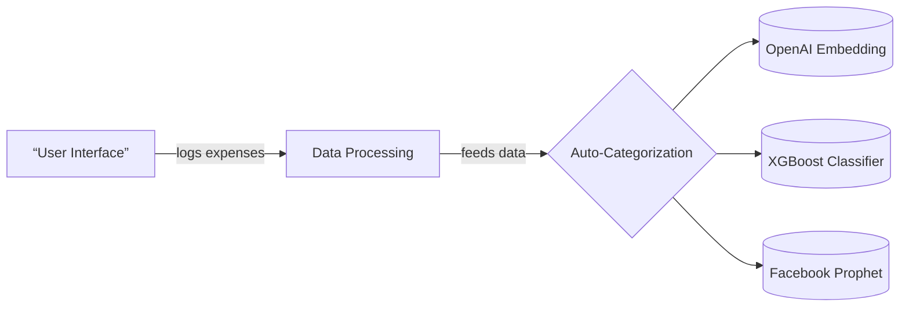

# Buck Web Application

```markdown
# Expense Forecasting System

## Overview
A modular system designed to track expenses and forecast spending using AI-powered components. The architecture
integrates frontend user interfaces with backend processing and specialized machine learning models.

---

## Architecture Components

### 1️⃣ Frontend (React/Next.js + Firebase Auth)
- **Purpose**: User interaction interface for expense logging, goal management, and visualization
- **Key Features**:
  - Expense input forms with real-time validation
  - Interactive UI for setting financial goals (Normal/Moderate/Aggressive profiles)
  - Data visualization dashboard showcasing spending forecasts and insights
  - Authentication system using Firebase identity services

### 2️⃣ Backend (Python FastAPI/Flask)
- **Purpose**: Core business logic processing and API gateway
- **Responsibilities**:
  ```python
  • Processes raw expense data from frontend
  • Orchestrates AI model workflows for predictions
  • Coordinates data storage across all components
  • Serves as communication bridge between frontend/UI and ML services
  ```

### 3️⃣ AI Engine (Python)
- **Powered by Three Integrated Machine Learning Models**:
  - **OpenAI Embedding API**: Auto-categorization of expenses using advanced NLP embeddings

  ```mermaid
  graph TD;
    A[Expense Text] --> B((Embedding));
    B --> C{Category Prediction};
    C --> D[Lifestyle Expenses];
    C --> E[Utilities];
    C --> F[Dining Out];
  ```

  - **XGBoost Classifier**: Predicts adjustment multipliers based on:
    ```python
      • User's historical saving patterns
      • Financial goal profiles (Normal/Moderate/Aggressive)
      • Behavioral spending signatures
    ```

  - **Facebook Prophet**:
    - Time-series forecasting of monthly spending trends
    - Adapts predictions dynamically to detect behavioral changes
    - Incorporates emergency scenario adjustments

---

## Data Flow Diagram

```markdown
## Data Flow Diagram


```

---

## Technologies Used

| Component | Stack Highlights |
|-----------|------------------|
| Frontend   | React, Next.js, Firebase Authentication, Tailwind CSS |
| Backend    | Python (FastAPI/Flask), PostgreSQL, Redis caching |
| AI Engine   | XGBoost, OpenAI API, Prophet time-series library |

---

## System Features

- **Auto-expense categorization** using transformer embeddings
- **Dynamic forecasting** adapting to user behavioral patterns
- **Multi-model integration** for comprehensive financial insights
- **Firebase-backed authentication** ensuring secure transactions
```
