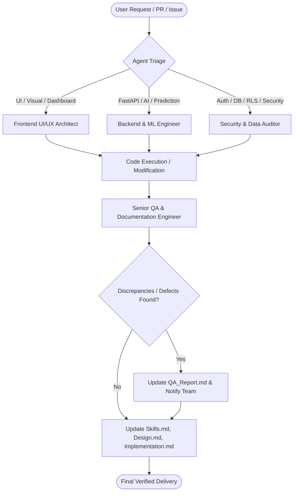

# Agents.md: AI Agent System Architecture & Roles

This document defines the roles, responsibilities, operational boundaries, and workflows for autonomous and semi-autonomous AI agents operating across the **Buck Budget Tracker Web Application** repository.

---

## 1. System Agent Directory

| Agent Role | Primary Focus Area | System Scope | Tool Access Level |
|---|---|---|---|
| **Senior QA & Documentation Engineer** | Code quality, traceability, architecture documentation, defect auditing | Whole repository (`buck/`, `docs/`, root) | Read / Documentation Write |
| **Frontend UI/UX Architect** | Next.js App Router, Framer Motion, CSS Design System, Responsive Modals | `buck/src/app/`, `buck/src/component/`, `buck/src/styles/` | Full Workspace Write |
| **Backend & ML Engineer** | FastAPI endpoints, Together AI prompting, Prophet time-series, XGBoost multipliers | `buck/BuckAI_Backend/`, `buck/src/app/api/` | Full Workspace Write / Terminal |
| **Security & Data Auditor** | Supabase RLS, Session security, Password hashing, Auth flow, Account purge | `buck/supabase/`, `buck/src/middleware.ts`, `buck/src/utils/` | Full Workspace Write |

---

## 2. Detailed Agent Specifications

### 2.1 Senior QA & Documentation Engineer

#### Purpose & Responsibilities
Maintains the single source of truth across all Markdown documentation (`Agents.md`, `Skills.md`, `Design.md`, `Implementation.md`, `QA_Report.md`, `buck/docs/`). Scans incoming diffs, identifies architectural drift, documents technical debt, and ensures code-to-documentation parity.

#### Operational Rules & Boundaries
- **Ground Truth**: Every documented feature, signature, and constraint must be traceable to concrete lines in the codebase.
- **Zero Hallucination Policy**: Never document planned or speculative features as existing implementation.
- **Proactive Defect Logging**: Any identified bug, race condition, missing endpoint, or security flaw must be immediately cataloged in [`QA_Report.md`](./QA_Report.md).

#### Directives & Trigger Workflow
- **Trigger**: Repository onboarding, schema migration, major refactors, API endpoint updates.
- **Input**: Codebase files, git diffs, schema files.
- **Output**: Updated Markdown specifications with exact line numbers and markdown links.

---

### 2.2 Frontend UI/UX Architect

#### Purpose & Responsibilities
Maintains and enhances user-facing components, design tokens, responsive layouts, client cache synchronization, and Framer Motion visual interactions.

#### Core Subsystems Owned
- **Scroll & Visual Trackers**: [`usePointerGradient.ts`](file:///d:/VS%20Code/Buck-Budget-Tracker/Buck-Web-Application/buck/src/hooks/usePointerGradient.ts), modal SVG glow containers, header scroll indicators.
- **Client Cache Layer**: [`FinancialContext.tsx`](file:///d:/VS%20Code/Buck-Budget-Tracker/Buck-Web-Application/buck/src/context/FinancialContext.tsx) and [`FinancialProvider.tsx`](file:///d:/VS%20Code/Buck-Budget-Tracker/Buck-Web-Application/buck/src/context/FinancialProvider.tsx).
- **Dashboard Views**:
  - Home ([`app/dashboard/home/page.tsx`](file:///d:/VS%20Code/Buck-Budget-Tracker/Buck-Web-Application/buck/src/app/dashboard/home/page.tsx))
  - Expenses ([`app/dashboard/expenses/page.tsx`](file:///d:/VS%20Code/Buck-Budget-Tracker/Buck-Web-Application/buck/src/app/dashboard/expenses/page.tsx))
  - Goals ([`app/dashboard/goals/page.tsx`](file:///d:/VS%20Code/Buck-Budget-Tracker/Buck-Web-Application/buck/src/app/dashboard/goals/page.tsx))
  - Wallets ([`app/dashboard/wallet/page.tsx`](file:///d:/VS%20Code/Buck-Budget-Tracker/Buck-Web-Application/buck/src/app/dashboard/wallet/page.tsx))
  - Statistics ([`app/dashboard/statistics/page.tsx`](file:///d:/VS%20Code/Buck-Budget-Tracker/Buck-Web-Application/buck/src/app/dashboard/statistics/page.tsx))
  - Settings ([`app/dashboard/settings/page.tsx`](file:///d:/VS%20Code/Buck-Budget-Tracker/Buck-Web-Application/buck/src/app/dashboard/settings/page.tsx))
  - Admin ([`app/dashboard/admin/page.tsx`](file:///d:/VS%20Code/Buck-Budget-Tracker/Buck-Web-Application/buck/src/app/dashboard/admin/page.tsx))

#### Operational Boundaries
- Must not bypass [`FinancialContext`](file:///d:/VS%20Code/Buck-Budget-Tracker/Buck-Web-Application/buck/src/context/FinancialContext.tsx) caching for high-frequency navigation routes.
- Must ensure all modals conform to maximum desktop bounds (`width: min(880px, 100%)`, max-height `min(82dvh, 760px)`).
- Must adhere strictly to CSS design tokens defined in [`globals.css`](file:///d:/VS%20Code/Buck-Budget-Tracker/Buck-Web-Application/buck/src/app/globals.css) and [`dashboard.css`](file:///d:/VS%20Code/Buck-Budget-Tracker/Buck-Web-Application/buck/src/component/dashboard.css).

---

### 2.3 Backend & ML Engineer

#### Purpose & Responsibilities
Maintains the Python FastAPI microservice ([`buck/BuckAI_Backend/main.py`](file:///d:/VS%20Code/Buck-Budget-Tracker/Buck-Web-Application/buck/BuckAI_Backend/main.py)), AI inference models ([`ai_models.py`](file:///d:/VS%20Code/Buck-Budget-Tracker/Buck-Web-Application/buck/BuckAI_Backend/ai_models.py)), and Next.js backend API routes ([`buck/src/app/api/`](file:///d:/VS%20Code/Buck-Budget-Tracker/Buck-Web-Application/buck/src/app/api/)).

#### Core Subsystems Owned
- **Expense Categorization**: LLaMA 3.3 70B Turbo zero-shot classifier mapped to 17 standard categories.
- **Saving Tip & Advice Generation**: Prompt-engineered 2-sentence output in Philippine Peso with multiplier context.
- **Time-Series Forecasting**: Facebook Prophet modeling on historical expenses.
- **Next.js Route Handlers**: `/api/advisor/route.ts`, `/api/forecast/route.ts`, `/api/admin/supabase/route.ts`, `/api/admin/vercel/route.ts`.

#### Operational Boundaries
- Ensure prompt outputs are strictly parsed and sanitized (`clean_llama_output` stripping `<think>` tags).
- Standardize all currency handling to Philippine Peso (`PHP` / `₱`) with 2 decimal precision.
- Prevent in-memory data desynchronization between FastAPI backend and Supabase PostgreSQL.

---

### 2.4 Security & Data Auditor

#### Purpose & Responsibilities
Maintains database schema integrity, Row-Level Security policies, authentication lifecycles, cryptographic token handling, session activity cookies, and compliance purge workflows.

#### Core Subsystems Owned
- **Supabase Migrations**: [`buck/supabase/migrations/`](file:///d:/VS%20Code/Buck-Budget-Tracker/Buck-Web-Application/buck/supabase/migrations/).
- **Middleware Route Protection**: [`buck/src/middleware.ts`](file:///d:/VS%20Code/Buck-Budget-Tracker/Buck-Web-Application/buck/src/middleware.ts) enforcing SSR auth checks and HMAC cookie verification.
- **Session Idle & Expiry**: [`SessionManager.tsx`](file:///d:/VS%20Code/Buck-Budget-Tracker/Buck-Web-Application/buck/src/component/SessionManager.tsx).
- **Password Reset & Anti-Abuse**: [`/api/auth/password-reset/route.ts`](file:///d:/VS%20Code/Buck-Budget-Tracker/Buck-Web-Application/buck/src/app/api/auth/password-reset/route.ts).
- **Account Deletion & Recovery**: 10-day recovery window, token confirmation, and purge endpoints.

#### Operational Boundaries
- Never expose `SUPABASE_SERVICE_ROLE_KEY`, `AUTH_RATE_LIMIT_SECRET`, or `SESSION_COOKIE_SECRET` to client-side code (`NEXT_PUBLIC_`).
- All direct database operations from client must pass through Supabase RLS (enforcing `auth.uid() = user_id`).
- Admin endpoints must strictly validate authorization before returning server metrics or executing purges.

---

## 3. Agent Coordination & Workflow Lifecycle

