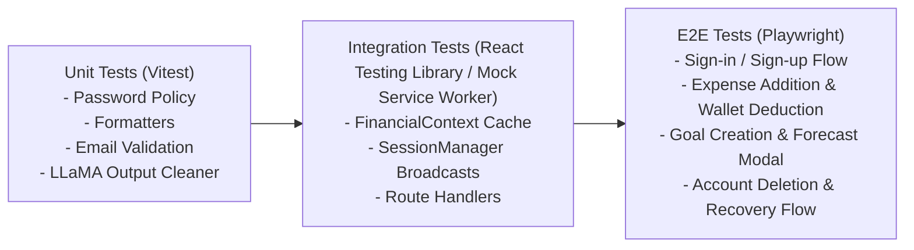

# QA_Report.md: Code Quality, Defect Backlog & Test Strategy

This document tracks identified bugs, architectural discrepancies, security vulnerabilities, technical debt, and test strategies across the **Buck Budget Tracker Web Application**.

---

## 1. Executive QA Summary & Codebase Health

| Metric | Assessment | Notes |
|---|---|---|
| **Overall Code Health** | ⚠️ **Moderate (Action Required)** | Core frontend UI and Supabase database architecture are robust; significant discrepancies exist in AI microservice integration. |
| **Authentication & RLS** | 🟢 **Strong** | Strict PostgreSQL Row-Level Security, HMAC-SHA256 session activity cookies, 30m idle timeouts, and rate-limited reset flow. |
| **Frontend State & Motion** | 🟢 **Strong** | High-performance in-memory cache in `FinancialContext`, clean Framer Motion integration, smooth modal glow math. |
| **AI Microservice Integrity** | 🔴 **Critical Deficiencies** | Dead endpoints, URL mismatches, ephemeral in-memory storage, and stubbed API routes. |
| **Automated Test Coverage** | 🔴 **0% (No Test Runner)** | No unit, integration, or E2E test runner configured in `package.json`. |

---

## 2. Defect & Discrepancy Backlog

### 🔴 Critical Severity

#### BUG-001: Dead Endpoint Invocation in `aiApi.ts`
- **Location**: [`buck/src/utils/aiApi.ts:17-28`](../src/utils/aiApi.ts#L17-L28)
- **Impact**: Any invocation of `processExpense()` fails with an HTTP 404 error.
- **Root Cause**: `aiApi.ts` targets `https://buck-web-application.onrender.com/process_expense/`. In the FastAPI backend ([`buck/BuckAI_Backend/main.py`](../BuckAI_Backend/main.py)), the route is named `/ai/categorize_expense/` or `/expenses/`. Route `/process_expense/` does not exist.
- **Remediation**: Align the API endpoint naming between `aiApi.ts` and `main.py`.

---

### 🟠 High Severity

#### BUG-002: Inconsistent Backend Host Domains Across Frontend Modules
- **Location**: [`buck/src/utils/aiApi.ts:17,20`](file:///d:/VS%20Code/Buck-Budget-Tracker/Buck-Web-Application/buck/src/utils/aiApi.ts#L17) vs [`buck/src/app/dashboard/goals/page.tsx:524`](file:///d:/VS%20Code/Buck-Budget-Tracker/Buck-Web-Application/buck/src/app/dashboard/goals/page.tsx#L524)
- **Impact**: AI forecast and AI saving tip requests are routed to different Render deployment instances (`buck-web-application` vs `buck-web-application-1`).
- **Root Cause**: Hardcoded URLs in source files instead of utilizing a unified `NEXT_PUBLIC_AI_BACKEND_URL` environment variable.
- **Remediation**: Create a centralized environment configuration `process.env.NEXT_PUBLIC_AI_BACKEND_URL` and reference it everywhere.

#### BUG-003: FastAPI In-Memory Storage Desynchronization & Data Loss
- **Location**: [`buck/BuckAI_Backend/main.py:19-20, 114-128`](file:///d:/VS%20Code/Buck-Budget-Tracker/Buck-Web-Application/buck/BuckAI_Backend/main.py#L19-L20)
- **Impact**: The AI forecast endpoint `/ai/forecast/` calculates historical spending trends from `expenses_db.get(key, [])`, which is always empty.
- **Root Cause**: Expenses are inserted directly into Supabase PostgreSQL from the Next.js frontend via [`supabaseData.ts`](file:///d:/VS%20Code/Buck-Budget-Tracker/Buck-Web-Application/buck/src/utils/supabaseData.ts). The FastAPI backend maintains an isolated in-memory Python dictionary `expenses_db: Dict[str, List[dict]] = {}` that is never populated and resets on every server spin-down.
- **Remediation**: Pass historical expense records directly in the `/ai/forecast/` request payload from the frontend or connect FastAPI directly to Supabase using a service client.

---

### 🟡 Medium Severity

#### BUG-004: Stubbed Next.js AI Route Handlers
- **Location**: [`buck/src/app/api/advisor/route.ts:14-16`](file:///d:/VS%20Code/Buck-Budget-Tracker/Buck-Web-Application/buck/src/app/api/advisor/route.ts#L14-L16) and [`buck/src/app/api/forecast/route.ts:14-17`](file:///d:/VS%20Code/Buck-Budget-Tracker/Buck-Web-Application/buck/src/app/api/forecast/route.ts#L14-L17)
- **Impact**: The dedicated Next.js AI endpoints return static placeholder strings (`"To be implemented"`) and zero projected savings.
- **Root Cause**: Incomplete feature implementation between frontend route handlers and backend inference services.
- **Remediation**: Implement proxy logic in these route handlers to forward sanitized user context to the FastAPI backend or Together AI directly.

#### BUG-005: Hardcoded Administrator Email Address in Multiple Files
- **Location**:
  - [`buck/src/middleware.ts:378`](file:///d:/VS%20Code/Buck-Budget-Tracker/Buck-Web-Application/buck/src/middleware.ts#L378)
  - [`buck/src/app/api/admin/supabase/route.ts:20`](file:///d:/VS%20Code/Buck-Budget-Tracker/Buck-Web-Application/buck/src/app/api/admin/supabase/route.ts#L20)
  - [`buck/src/app/api/admin/vercel/route.ts:20`](file:///d:/VS%20Code/Buck-Budget-Tracker/Buck-Web-Application/buck/src/app/api/admin/vercel/route.ts#L20)
  - [`buck/docs/admin-backend-caching.md:26`](file:///d:/VS%20Code/Buck-Budget-Tracker/Buck-Web-Application/buck/docs/admin-backend-caching.md#L26)
- **Impact**: Inability to configure or rotate administrator credentials without modifying and redeploying core source code.
- **Remediation**: Migrate admin validation to an environment variable `ADMIN_EMAIL` or implement role-based access control (RBAC) via Supabase custom user claims (`app_metadata.role = 'admin'`).

---

### 🟢 Low Severity / Tech Debt

#### BUG-006: Orphaned Root `package.json`
- **Location**: [`package.json:1-6`](file:///d:/VS%20Code/Buck-Budget-Tracker/Buck-Web-Application/package.json#L1-L6)
- **Impact**: Developers running `npm install` at the workspace root do not install the actual application dependencies located in `buck/`.
- **Root Cause**: The workspace contains a bare `package.json` at root without npm workspace configuration pointing to `buck/`.
- **Remediation**: Define `"workspaces": ["buck"]` in the root `package.json` or consolidate project configuration.

#### BUG-007: Unused Dependencies & Dead Imports in `ai_models.py`
- **Location**: [`buck/BuckAI_Backend/ai_models.py:2,13,15`](file:///d:/VS%20Code/Buck-Budget-Tracker/Buck-Web-Application/buck/BuckAI_Backend/ai_models.py#L2)
- **Impact**: Unnecessary dependency bloat and confusion over active LLM providers.
- **Root Cause**: Code imports `openai` and mentions OpenAI embedding model comments, but actually calls the Together AI HTTP endpoint using `requests`.
- **Remediation**: Clean up unused imports and align documentation with the Together AI integration.

---

## 3. Security & Compliance Audit Matrix

| Security Control | Implementation Mechanism | Status | Notes |
|---|---|---|---|
| **Data Isolation (RLS)** | PostgreSQL Row-Level Security on all user tables | 🟢 **PASS** | Strict `auth.uid() = user_id` check across select/insert/update/delete. |
| **Session Activity Verification** | HMAC-SHA256 Signed Cookie (`buck-session-activity`) | 🟢 **PASS** | Prevents cookie tampering; verified on every protected request in `middleware.ts`. |
| **Session Inactivity Expiry** | 30-minute idle threshold with cross-tab Broadcast sync | 🟢 **PASS** | Synchronized across all tabs via `SessionManager.tsx`. |
| **Password Reset Rate Limiting** | SHA-256 HMAC hashed IP/email window in `auth_security_events` | 🟢 **PASS** | Zero plaintext IP/email retention; enforces 8 resets / 15 min per IP. |
| **Account Deletion Safeguards** | 10-day recovery window + OTP confirmation token | 🟢 **PASS** | Prevents accidental data destruction with self-service cancellation. |
| **Private File Storage** | Supabase Storage RLS on `profile-avatars` | 🟢 **PASS** | Folders isolated by `auth.uid()`; signed URLs or SSR proxy stream required for access. |

---

## 4. Testing & Verification Strategy

### 4.1 Recommended Automated Testing Architecture

To achieve enterprise-grade reliability, the repository requires the following testing framework:

### 4.2 Manual QA Regression Test Checklist

1. **Authentication & Session**:
   - [ ] Sign up with valid password matching all 5 policy criteria.
   - [ ] Confirm email redirect flow and automatic category seeding.
   - [ ] Idle for 29 minutes $\rightarrow$ verify 60s warning modal appears $\rightarrow$ click "Stay Signed In" $\rightarrow$ confirm session extension.
   - [ ] Request password reset 9 times from same IP $\rightarrow$ confirm HTTP 429 Rate Limit on 9th attempt.
2. **Financial Operations**:
   - [ ] Create wallet with budget ₱5,000.
   - [ ] Add expense of ₱1,200 under "Food" $\rightarrow$ verify wallet balance reduces to ₱3,800.
   - [ ] Delete expense $\rightarrow$ verify wallet balance restores to ₱5,000.
   - [ ] Soft delete wallet $\rightarrow$ verify wallet is hidden from active list but appears in Wallet History.
3. **Goal Tracking & AI**:
   - [ ] Create goal "Emergency Fund" for ₱20,000 with Moderate attitude.
   - [ ] Open Goal Forecast modal $\rightarrow$ verify time range calculations.
4. **Account Management & Danger Zone**:
   - [ ] Request account deletion $\rightarrow$ verify confirmation email dispatched.
   - [ ] Open confirmation link $\rightarrow$ verify status transitions to "Scheduled for Deletion (10-day recovery)".
   - [ ] Click "Recover Account" $\rightarrow$ verify deletion status is revoked.
